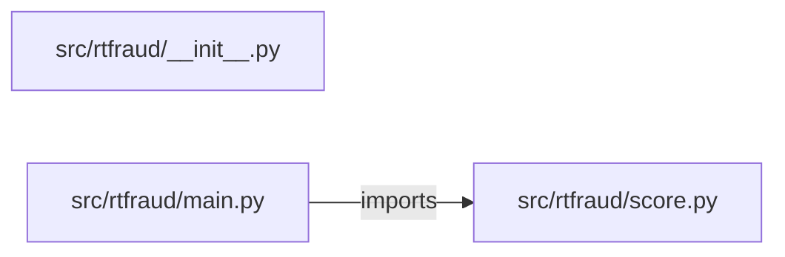

# real-time-fraud-detection-ml-platform — project architecture

[README](README.md) · [Interview questions and answers](INTERVIEW_QA.md)

## Purpose and scope

Score amount, device_changes, and merchant_risk. At or above 0 is hold. No card is charged.

This document describes files and symbols in this checkout. Deployment templates and statements in the original overview are distinguished from a verified running environment.

## Component diagram



For Python repositories, arrows show resolved local imports, not network calls or deployment order. Otherwise the diagram is a repository component map; containment arrows do not assert runtime integration.

## Components and responsibilities

| Component | Responsibility |
| --- | --- |
| [`src/rtfraud/main.py`](src/rtfraud/main.py) | HTTP handlers: `GET /healthz`, `POST /score` |
| [`src/rtfraud/score.py`](src/rtfraud/score.py) | Functions: `score` |
| [`requirements.txt`](requirements.txt) | Implementation or supporting configuration |
| [`src/rtfraud/__init__.py`](src/rtfraud/__init__.py) | Implementation or supporting configuration |
| [`tests/test_score.py`](tests/test_score.py) | Executable checks and regression examples |
| [`.github/workflows/ci.yml`](.github/workflows/ci.yml) | GitHub Actions job definitions |
| [`README.md`](README.md) | Project explanations or operating notes |

## Request interface

| Method and path | Handler | Source |
| --- | --- | --- |
| `GET /healthz` | `healthz` | [`src/rtfraud/main.py`](src/rtfraud/main.py#L8) |
| `POST /score` | `post_score` | [`src/rtfraud/main.py`](src/rtfraud/main.py#L13) |

The table lists literal route decorators found in the inspected Python modules. Router prefixes and middleware can add behavior; check the linked handler and application setup before calling an endpoint.

## Implementation walkthrough

### `score(body)`

Source: [`src/rtfraud/score.py`](src/rtfraud/score.py#L11).

Calls visible in this function: `', '.join`, `InputError`, `WEIGHTS.items`, `isinstance`, `parts.append`, `round`.

```python
def score(body):
    missing = [name for name in REQUIRED if name not in body]
    if missing:
        raise InputError("missing " + ", ".join(missing))
    total = INTERCEPT
    parts = []
    for name, weight in WEIGHTS.items():
        value = body[name]
        if not isinstance(value, (int, float)) or isinstance(value, bool):
            raise InputError(f"{name} must be a number")
        contrib = weight * value
        total += contrib
        parts.append({"feature": name, "contribution": round(contrib, 4)})
    label = "hold" if total >= THRESHOLD else "pass"
    return {"score": round(total, 4), "label": label, "threshold": THRESHOLD, "parts": parts}
```

## Validation and failure paths

| Explicit exception | Source |
| --- | --- |
| `HTTPException(status_code=422, detail=str(exc))` | [`src/rtfraud/main.py`](src/rtfraud/main.py#L17) |
| `InputError('missing ' + ', '.join(missing))` | [`src/rtfraud/score.py`](src/rtfraud/score.py#L14) |
| `InputError(f'{name} must be a number')` | [`src/rtfraud/score.py`](src/rtfraud/score.py#L20) |

These are explicit exceptions in the inspected source, rather than a claim that every failure is handled. Follow the calling handler to see whether the exception becomes an HTTP response or propagates.

## Data and state

- [`src/rtfraud/score.py`](src/rtfraud/score.py) defines module-level containers: `WEIGHTS`.

Module-level dictionaries/lists live in a Python process. They can be fixtures or mutable state; inspect writes before treating them as persistent storage. A production extension would need to define persistence and concurrency behavior explicitly.

## Data flow and design decisions

### What is the input-to-output contract of `score`

In [`src/rtfraud/score.py`](src/rtfraud/score.py#L11), `score(body)` receives the inputs. The function computes these intermediate values:

- `missing = [name for name in REQUIRED if name not in body]`
- `total = INTERCEPT`
- `parts = []`
- `label = 'hold' if total >= THRESHOLD else 'pass'`

Its result is defined by:

- `{'score': round(total, 4), 'label': label, 'threshold': THRESHOLD, 'parts': parts}`

### Which decision rules or boundary conditions should an interviewer challenge

The implementation in [`src/rtfraud/score.py`](src/rtfraud/score.py#L11) branches on:

- `missing`
- `not isinstance(value, (int, float)) or isinstance(value, bool)`

A useful extension is a table-driven test that covers each condition just below, at, and above its boundary where applicable. These expressions are the current rules; changing them changes behavior and should be justified by the project’s acceptance criteria.

## Setup and verification

The following commands are derived from the checked-in dependency/test contracts. Execute them from the repository root; the block prepares a local environment, not a cloud deployment.

```bash
python3 -m venv .venv
source .venv/bin/activate
python -m pip install -r requirements.txt
python -m pytest -q
```

Python dependencies: [`requirements.txt`](requirements.txt).

Test entry points: [`tests/test_score.py`](tests/test_score.py).

Automation definitions: [`.github/workflows/ci.yml`](.github/workflows/ci.yml). Read their triggers and job steps to determine what CI actually runs.

## Operating boundaries and design review

Before turning this checkout into a customer deployment, establish the input contract, data ownership, access controls, failure response, evaluation criteria, and rollback owner. Repository fixtures and unit tests demonstrate local behavior; they do not establish throughput, uptime, compliance, or business impact.

A useful architecture review starts with the linked implementation: identify where input enters, where a decision is made, which state can change, and which external dependency can fail. Add a deployment view only for infrastructure that is actually configured and exercised.
