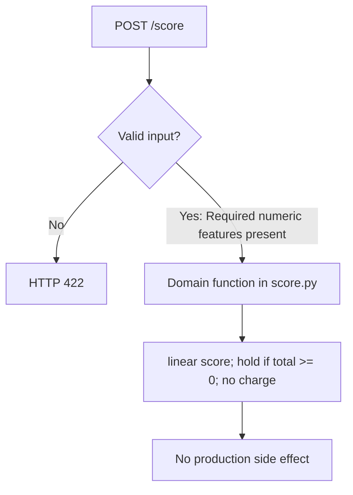

# Real-Time Fraud Detection ML Platform: process flows

## Domain request

Endpoint: `POST /score`. Stages summarize [src/rtfraud/score.py](../src/rtfraud/score.py). This is in-process Python, not a hosted model or production apply.

See [INTERVIEW_QA.md](../INTERVIEW_QA.md) for fixture walkthroughs and [PROJECT_ARCHITECTURE.md](../PROJECT_ARCHITECTURE.md) for the component map.
